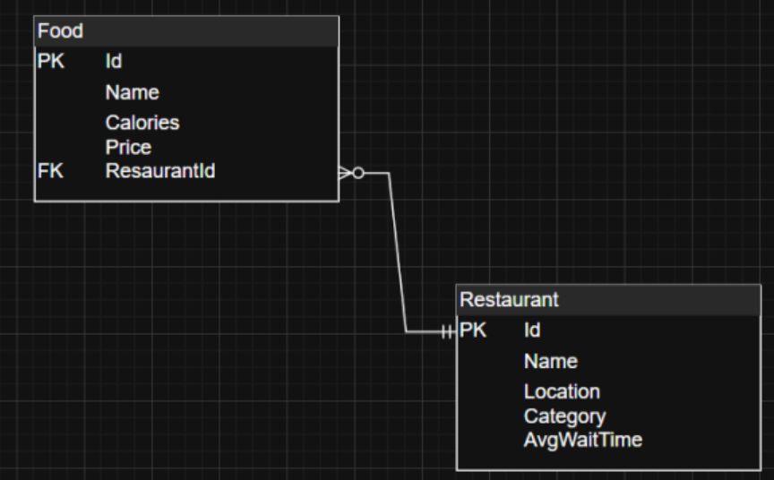
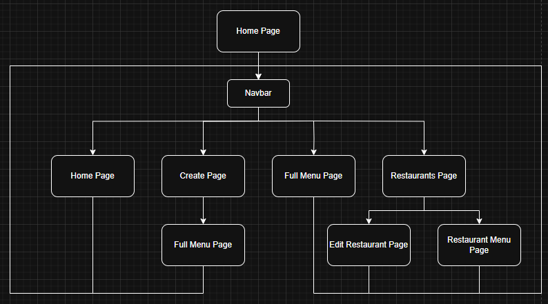
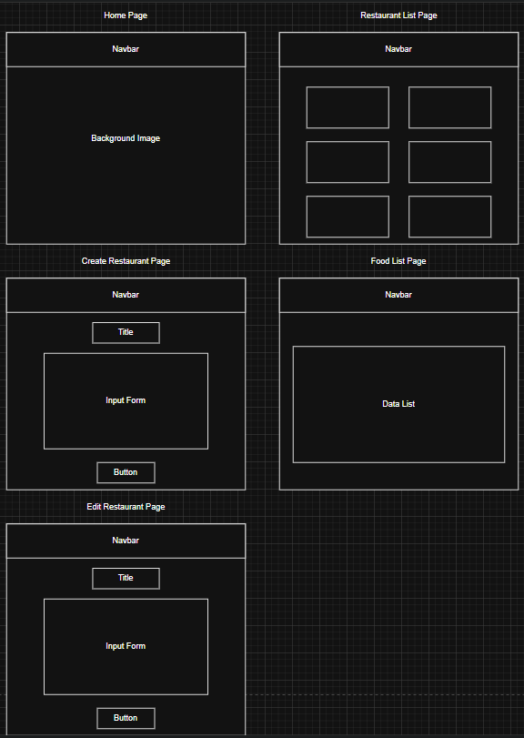
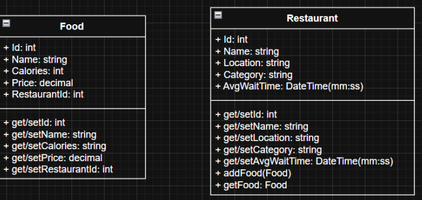

### Design Report

## Instructor Feedback
“Chance, excellent work on this assignment.” My initial project proposal was perfect and did not require any edits. In this proposal, I added a section at the end for the REST API. 

## Applications Description
I will be creating a Food Ordering Application, where the class object is the food, and it’s properties are the foods id, name, calories, and price.

## List of Requirements
As a customer, I want to be able to have food ordered and delivered to my house so I can enjoy more free time to take care of my house, be with friends/family, or get work done.

## ER Diagram

## Sitemap(Updated)

## Wireframes(Updated)

## UML Classes

## Risks
The biggest risks the program can be potentially facing are class objects not loading properly, partial views not loading properly, and databases not loading properly can cause data malfunctions.

## REST API
I have a total of 8 API entry points. There are two for getting all of the restaurants and foods, two for getting specific restaurants and foods, two for adding restaurants and foods, one for updating restaurants, and one for deleting restaurants. The API’s follow the hierarchical path where you need to go through the restaurant controller to get to the food controller.

## Updates Table
| Updates | Description |
|----------|----------|
| Application Created | I created the file tree with all necessary files to run the application, including class object models, routes, dao’s, queries, and controllers. Classes with the credentials to access a local database have also been instantiated.|
| Database Created | The MySQL database has been successfully deployed and connected. The application now interacts with the database through the HTTP methods being executed. |
| Routes Running | The routes have been established and all work properly to execute their associated HTTP methods. |
| UI Created | The UI application has been created with all necessary components to carry out the required functions. The UI is also equipped with a function navbar and has a service component implemented to interact with the API |
| API and UI Successfully Interact | The API and UI are able to send request back and forth so the UI never interacts with the database or the MySQL commands. |
| Designs | The wireframes have been updated to match the current state of the website. |
| Functionality | The website can perform all CRUD operations on the restaurants. However, only Delete can be performed on the foods, and that's only through deleting the restaurant associated with the food. CRUD operations for the foods will likely not be added and the foods will have to be added and edited directly through the database. Read is also available for the foods through viewing the entire menu at once. |
| Bugs | The restaurants individual menus cannot be shown. There's no restaurant name listed next to the menu items. The UI for the create page is poor, but the functionailty is sound. No Create or Update functions for the foods. |

## Postman Documentation
[CST-391 API Requests](https://documenter.getpostman.com/view/36500091/2sAYdcsCXR)

## Code 
[Front End](https://github.com/CJones001/MilestoneFrontEnd.git)
[Back End](https://github.com/CJones001/CST-391_Milestone.git)

## PowerPoint Presentation Link
[PowerPoint](CST-391_Milestone.pptx)
